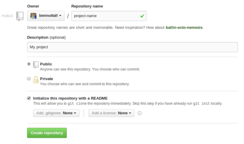
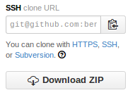

# Using Git

A guide to using git on the command line.

First, see the [Configuring Git Guide](git-config.md) to set up and connect to GitHub.

## Create a repository

There are two ways to create a repository: on the command line, and on GitHub.

`git init` requires you to create a repository on the command line and connect it to a GitHub repository (which you'll also need to create); whereas using `git clone` you only need to create the repository on GitHub then copy it to your computer, and easily push changes back to GitHub.

### git clone

`git clone` is easier to use than `git init`, so new users should start here.

1. Sign in to [github.com](https://github.com/), click the plus icon in the top bar and go to `New repository`.

    

1. On the new repository page, fill in the project title and description and make sure to tick the `Initialize this repository with a README` box.

    

1. Go to the repository on GitHub and click the `SSH` toggle beneath the clone URL box on the right hand side beneath the tabs; if you did not set up an SSH key, click `HTTPS`. Click the copy icon to copy the URL.

    

1. In the command line, enter `git clone` followed by the URL you just copied, i.e. `git@github.com:user/repo.git`. If you get an error on this step, see this [GitHub SSH error help page](https://help.github.com/articles/error-permission-denied-publickey).

### git init

As an alternative to `git clone`, you can create the git repository on the command line using `git init`.

1. Create a directory for your new project with `mkdir projectname` and enter the folder with `cd projectname`. If the project you want to add to GitHub already exists, make sure the project files are in their own folder, then `cd` into it.

1. Enter `git init` to initialise a git repository in the folder.

1. Sign in to [github.com](https://github.com/), click the plus icon in the top bar and go to `New repository`.

    

1. On the new repository page, fill in the project title and description. Make sure not to tick the `Initialize this repository with a README` box.

    

1. Go to the repository on GitHub and click the `SSH` toggle beneath the clone URL box on the right hand side beneath the tabs; if you did not set up an SSH key, click `HTTPS`. Click the copy icon to copy the URL.

    

1. Enter `git remote add github` followed by the URL you just copied, i.e. `git@github.com:user/repo.git`.

## Record changes to the repository

### Committing to the repository

Whether you used `git clone` or `git init`, you can now add files to your git repository's index and commit them to track changes.

1. Enter `git add -A` to add all files in the directory, or use `git add file1 file2 file3` to explicitly add files and folders. Note this only notifies git of the filenames, not their contents.

1. Enter `git status` to see what files git is aware of. Use `git add` to add more.

1. Enter `git commit -am "Initial commit"`; this will commit all files to the repository and the state of the project will be saved in this form in the repository's history. The `-a` means "all" (i.e. commit all files) and the `m` is for the commit message which follows. If the commit message is not given, your default editor (probably Nano) will be opened for you to enter it there.

1. Further commits should be given a meaningful commit message and should be in the form of an instruction, such as `Add worksheet` or `Fix typo`. Commit messages are shown on GitHub in the project's history, with author information attached.

## Connect with GitHub

### Pushing to GitHub

Once you're ready to put your changes on GitHub, you'll use `git push`.

1. Enter `git status` to check your changes are committed. You can perform multiple commits before pushing.

1. If you started with `git clone`, just enter `git push` to push your changes to GitHub.

1. If you used `git init`, you'll need to specify where to push to. Earlier you set up a remote location, and you can set this as the default remote location the first time you push. Use `git push -u github master`; this will set your upstream to the remote you named `github`.

### Pulling from GitHub

To pull changes made on GitHub, use `git pull`. If changes are made to GitHub's version, you must use `git pull` to get your repository up to date before pushing.

## Other tools

- [gitk](http://git-scm.com/docs/gitk)
    - Visual git repository browser tool
- [meld](http://meldmerge.org/)
    - Visual diff tool
