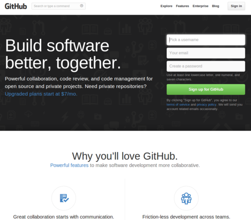
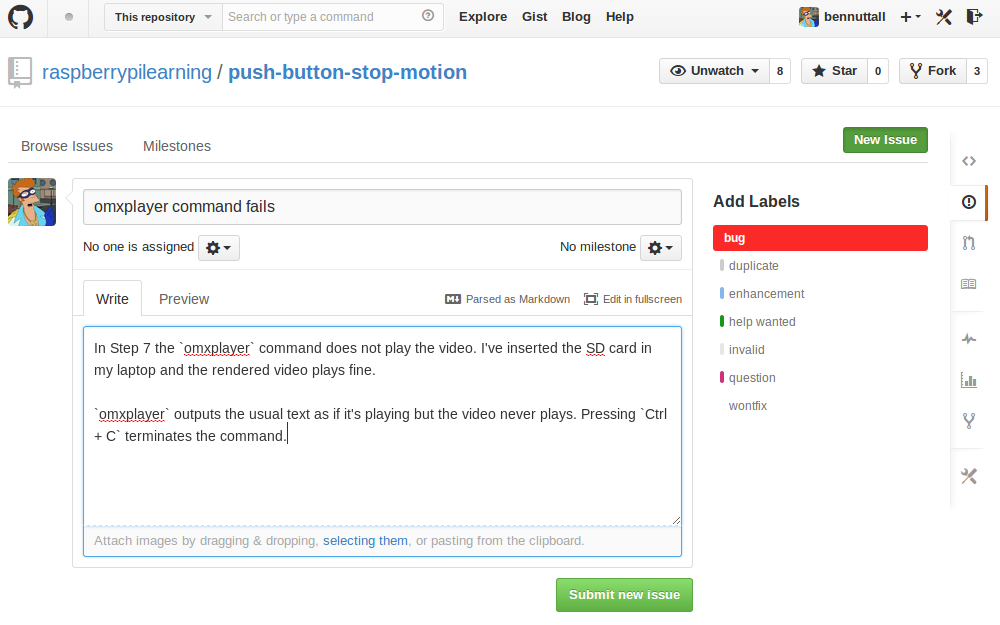
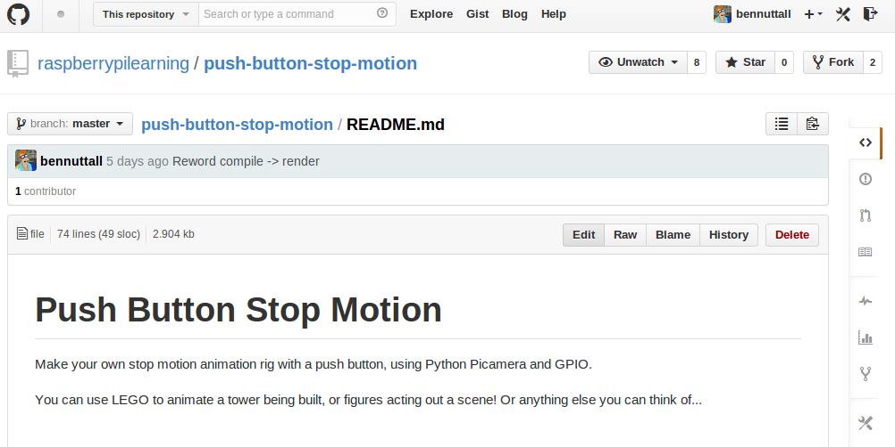
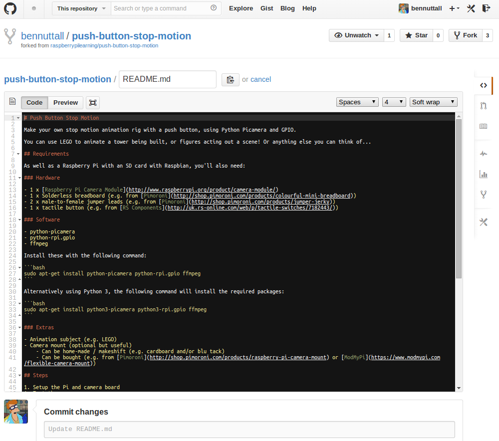
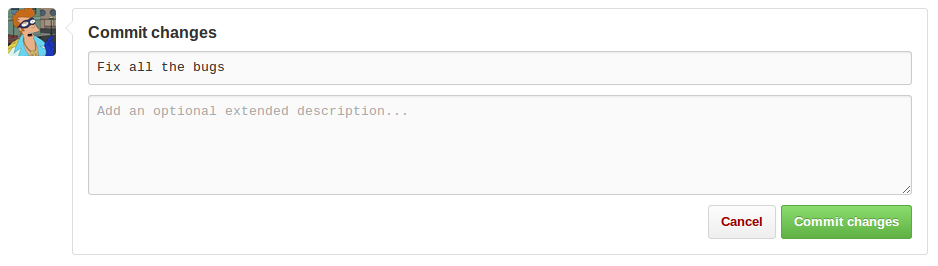
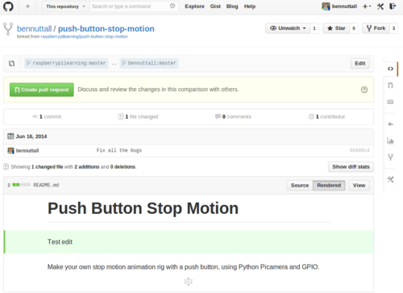

# Getting Started with GitHub

A guide to getting started on GitHub, particularly for educators looking to contribute [resources for the Raspberry Pi website](http://www.raspberrypi.org/resources/) or otherwise use GitHub in Education.

## Sign up to GitHub

Go to [github.com](https://github.com/) and sign up. You'll need to select a username which will determine your profile's URL, i.e. `github.com/username`, and provide an email address and password.

### Your profile page

Once you're signed up, your profile page will be public at `github.com/username`. This page will list your repositories as you create them, some biographical information, a visual representation of your contributions, and a feed of your recent activity.

You may wish to add a picture and fill in the basic biography fields on your [profile settings](https://github.com/settings/profile) page.

## Locate our repositories

You will find all of the repositories that contain our learning resources at [github.com/raspberrypilearning](https://github.com/raspberrypilearning). Alternatively, locate the resource on our website and scroll down to the footer to see the `View/edit this page on GitHub` link.

### Issues

If you find a problem with the content of one of our resources, such as a bug in the code or a poorly explained instruction, you can report this to us as an issue on the resource's GitHub repository.

To do this, navigate to the repository in question, go to the `Issues` tab on the right hand side and click the `New Issue` button.

Fill in the issue title and write as much detail as you can for us to identify the problem or reproduce the bug. One of our team will then look into the issue and attempt to resolve it. Some issues are easy to resolve, and can be fixed and closed swiftly; some take time to identify or reproduce and fix; some issues we consider invalid, such as a recommendation we believe reduces the intended educational value. A conversation may arise on an issue, where our team aim to determine the nature of the problem and communication with the user would be useful.

You can use Markdown to add links, emphasis and so forth. It is very useful to include a link to the file you're talking about, so that the reviewer can head straight over to look at the problem.

Be sure to read the contributing policy for a repository before opening an issue. You'll find this in the `CONTRIBUTING.md` file in the root of the repository.

### Editing

While browsing a file on GitHub, you will see an `Edit` button:

Clicking this will create a copy of the repository in your name; this process is called *forking*. For example, if you forked `github.com/raspberrypi/noobs` you would find your copy at `github.com/yourusername/noobs`, with the full history of the project available. Any changes made to your copy will not be reflected in the original repository until you request them to be merged, and the project maintainer does so.

Make your changes in the GitHub editor, enter a brief commit message and your version will be saved when you press `Commit changes`:

Commit messages should be given in the form of an instruction like `Add note about camera module` or `Update NOOBS version number` rather than in the past tense.

#### Pull requests

A pull request is the action of sending your changes to your fork of someone else's project back to the original author. They can then review your changes and have the option of accepting or denying your request.

Be sure to read the contributing policy for a repository before creating a pull request. You'll find this in the `CONTRIBUTING.md` file in the root of the repository.

### Contributing new resources

To create a new resource project, or to add an existing resource to GitHub, click the `+` icon in the navigation bar on GitHub, and select `New Repository`:

Follow the [Markdown guide](markdown-guide.md) and [structure guide](structure-guide.md) to learn how to write and format the material appropriately.

#### Submitting

See the [Submission notes](README.md#submissions) for more information.

## Using Git offline

GitHub's web interface can be used for a great deal of tasks; however, some will require using git on your computer, either with a GUI or using the command line.

GitHub's editor is suitable for small additions and modifications; if writing substantial amounts of material, it is advisable to use an offline editor and commit using git on your computer.

See the [Git guide](git.md) for more information.
